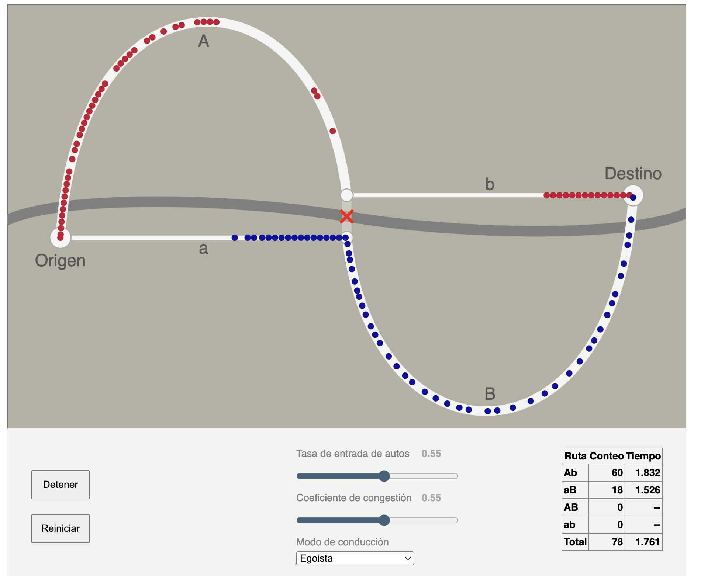

# Simulador de tráfico urbano - Paradoja de Braess
¿Más caminos significan mejor tráfico?

En esta simulación los autos desean transitar del punto de origen al punto de destino. El camino principal (en gris) no es una opción porque siempre está congestionado.

Puedes probarlo y ver una explicación en: https://ciudatoslab.org/modelos/paradoja-braess/

---
Un fork traducido al español y adaptado por [Ciudatos Lab](https://ciudatoslab.org/) en base al repo `traffic` de Bryan Hayes.
